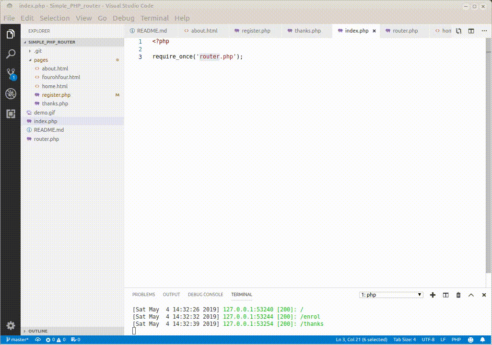

# simple php router
 

About as simple as possible and still be useful


## how does it work

It translates www.yoursite.com/gohere into 'pages/gotothispage.php'

## installation

* copy file to a directory of your choice
* open the directory with a terminal/console/cli
* start with `php -S localhost:4567`
* use a browser to navigate to `localhost:4567`
* try the routes in lines 9 - 11 of router.php:
	* localhost:4567
	* localhost:4567/about
	* localhost:4567/enrol

## structure

looks like this:
```
-------------------------------------------------------------------------------
 Language            Files        Lines         Code     Comments       Blanks
-------------------------------------------------------------------------------
 HTML                    3           45           30            0           15
 Markdown                1           19           19            0            0
 PHP                     5           98           63            8           27
-------------------------------------------------------------------------------
 Total                   9          162          112            8           42
 .
├── index.php
├── pages
│   ├── about.html
│   ├── fourohfour.html
│   ├── home.html
│   ├── register.php
│   ├── test.php
│   └── thanks.php
├── README.md
└── router.php
 ```
Help yourself to the code, and if it's of any use then a star would be nice (top right...) 